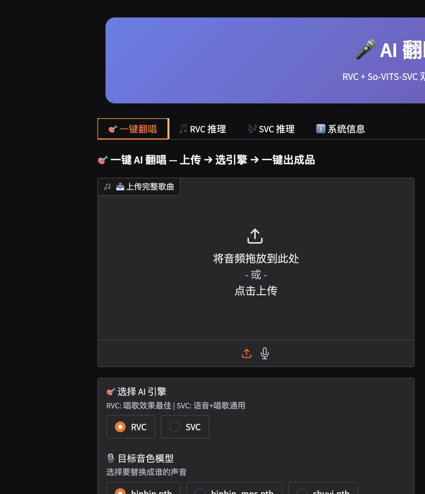
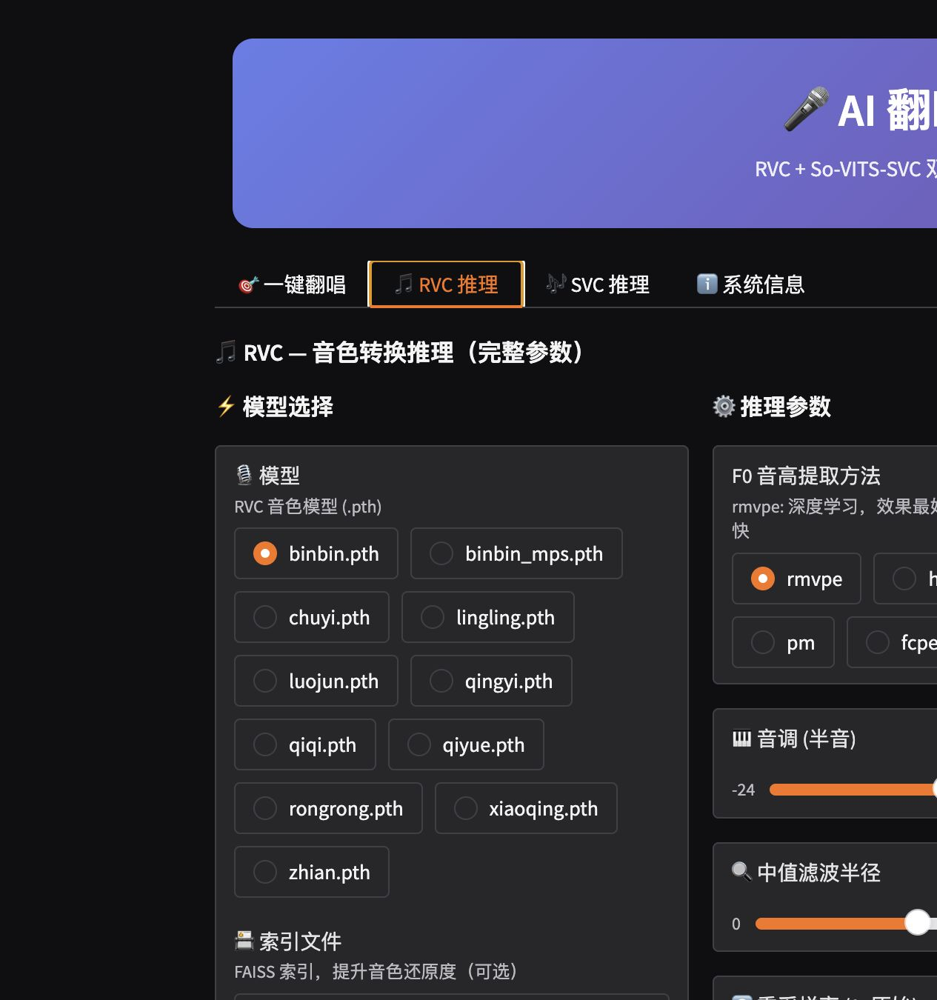
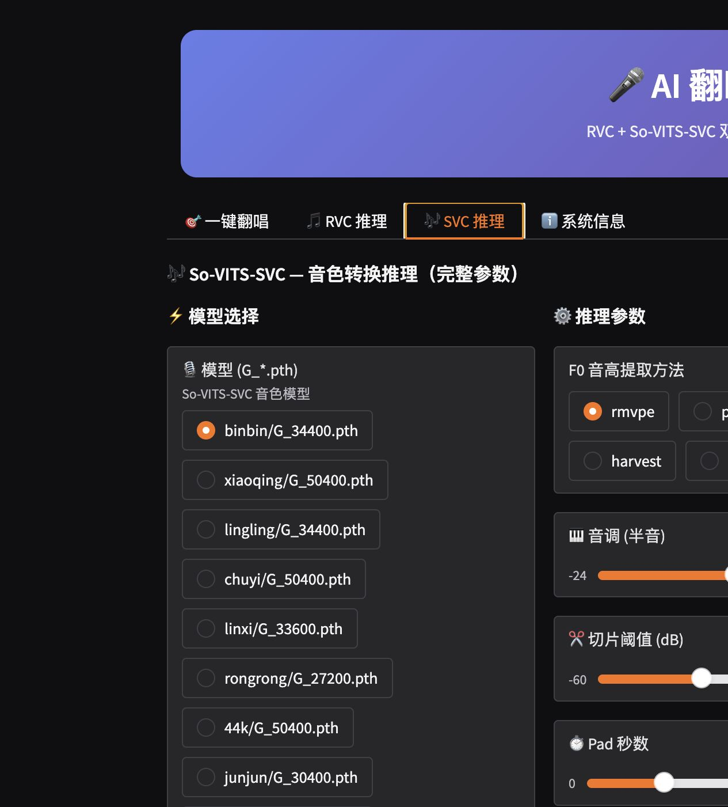
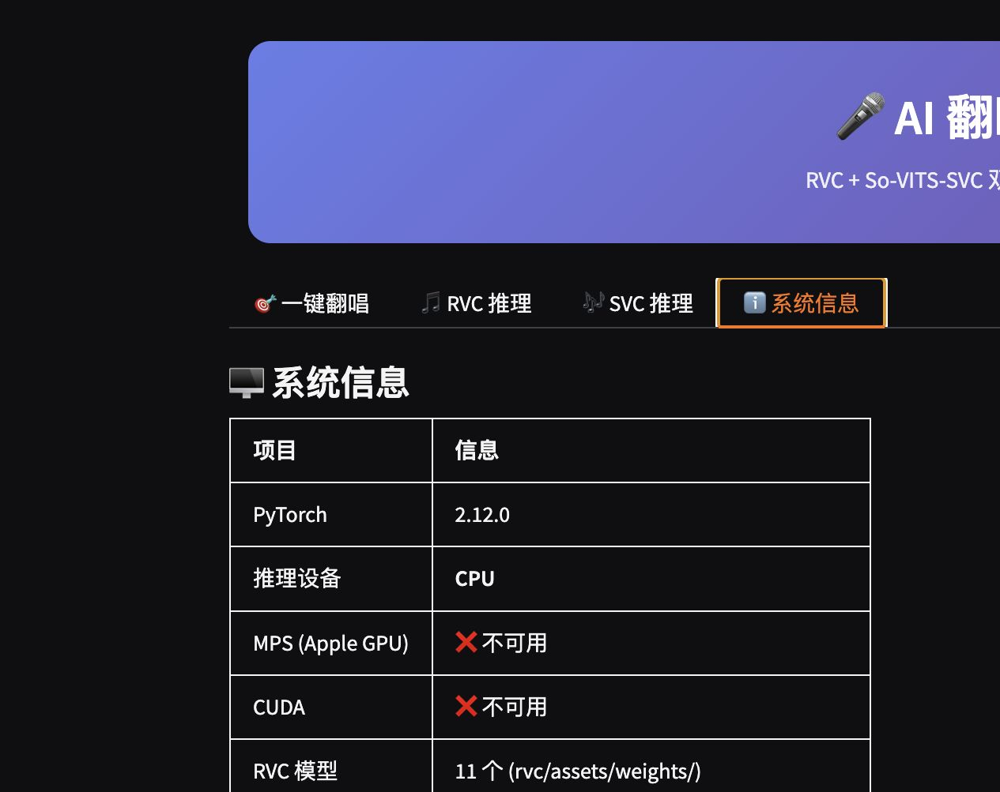

# AI 翻唱系统（macOS）

这是一个面向 macOS 的本地 AI 翻唱工作台，整合了 `RVC` 和 `So-VITS-SVC` 两套推理引擎，支持一键翻唱、独立推理、模型切换和本地混音。

## 这个项目能做什么

- 一键把整首歌转成目标音色
- 单独做 `RVC` 人声转换
- 单独做 `SVC` 人声转换
- 自动按当前机器选择 `MPS / CUDA / CPU`
- 本地运行，不需要把模型或歌曲传到云端

## 优点

- macOS 直接双击启动
- `RVC` 和 `SVC` 都能用
- 一份界面就能完成上传、选模型、调音高、混音、导出
- 代码、说明、截图可以公开，模型和歌曲留在本地

## 界面一览

### 一键翻唱



### RVC 推理



### SVC 推理



### 系统信息



## 启动方式

1. 双击桌面上的 `启动 AI 翻唱.command`
2. 选择启动模式
   - `3`：混合一体 WebUI（推荐）
   - `5`：混合一体 WebUI，稳定 CPU 模式
   - `1 / 2`：分别启动 RVC 或 SVC 独立页面
3. 等待终端显示本地地址
4. 打开浏览器访问 `http://127.0.0.1:7860`

## 使用流程

### 1）一键翻唱

1. 上传完整歌曲
2. 选择 `RVC` 或 `SVC`
3. 选择目标音色模型
4. 选择音调调整
5. 调整混音参数
6. 点击 `🚀 一键翻唱`

### 2）RVC 独立推理

1. 上传人声音频
2. 选 `RVC` 模型
3. 选 `F0` 方法和 `音调`
4. 需要的话加索引和呼吸保护
5. 点击开始推理

### 3）SVC 独立推理

1. 上传人声音频
2. 选 `SVC` 模型和说话人
3. 调整音调、噪声和切片参数
4. 点击开始推理

## 模型放哪里

程序真实读取的路径如下：

- `rvc/assets/weights/*.pth`
- `rvc/assets/indices/*.index`
- `so-vits-svc/logs/44k/G_*.pth`

`models/` 目录只保留了本地说明占位，不会把真实模型上传到 GitHub。

## 参数怎么理解

- `音调 (半音)`：每 `+12` 等于升高一个八度，每 `-12` 等于降低一个八度
- 如果你把干声升了 `+12`，伴奏也要一起 `+12`，不然整首歌会跑调
- `RVC` 更适合唱歌翻唱，`SVC` 更偏通用音色转换
- `rmvpe` 一般是默认推荐的 `F0` 提取方法

## 常见习惯

- 想要稳定：优先用 `CPU` 模式
- 想要速度：优先用 `MPS / CUDA`
- 想要效果：先用 `RVC`，再试 `SVC`
- 想要公开仓库：只提交代码、说明、截图，不提交模型、歌曲、日志和缓存

## 仓库内容说明

- `app.py`：统一 WebUI 入口
- `start.sh`：启动脚本
- `启动 AI 翻唱.command`：macOS 双击启动器
- `docs/screenshots/`：界面截图
- `models/`：本地占位说明

## 目录结构

```text
├── app.py
├── start.sh
├── 启动 AI 翻唱.command
├── rvc/
├── so-vits-svc/
├── docs/screenshots/
├── models/
└── output/
```

## 隐私和发布原则

- 不上传模型文件
- 不上传生成歌曲
- 不上传临时音频、日志、缓存、训练产物
- 不上传隐私文件

